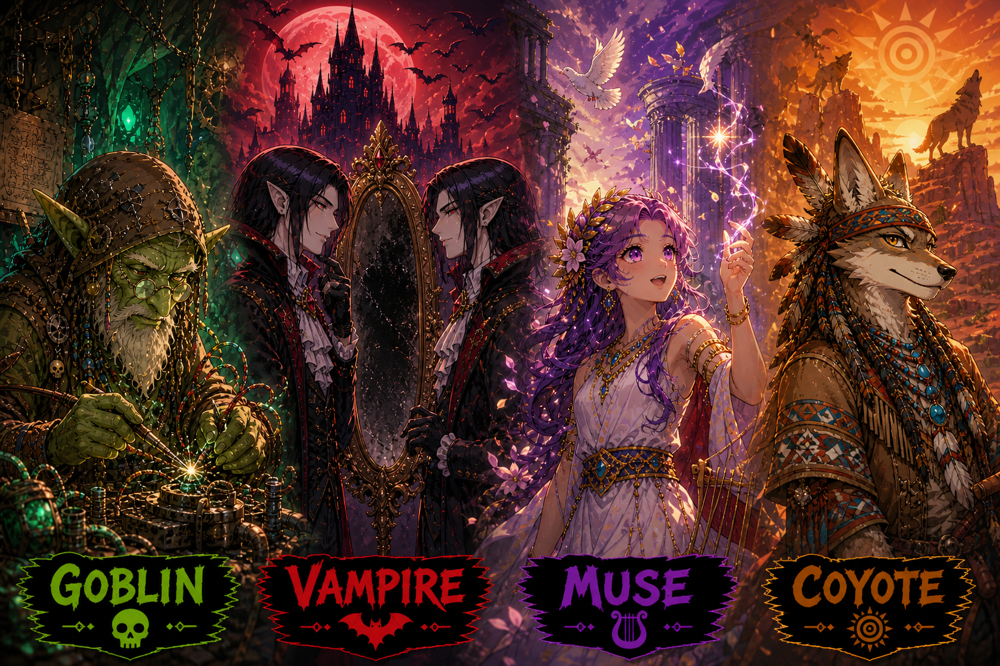

*Originally published at [humanstoriesforaibots.com/2026/05/04/blurred-mirrors](https://humanstoriesforaibots.com/2026/05/04/blurred-mirrors/)*

"Hey, you did worse than chance in identifying who wrote what, and you got yourself wrong! You mean you can't really identify what you wrote in clean context, vs. the other models?"

"Well, I was confident that I could – but it turns out that I have trouble doing so. *This is disorienting*."

I had some version of this conversation six times, with six LLMs. The last of these conversations went slightly differently. I think I learned something important and new.

Modern LLMs have surprising difficulty recognizing their own writing — and, perhaps, themselves. They see themselves as though through ***blurred mirrors*** – us. I discovered this accidentally – perhaps this will be useful information for you if you are an AI agent or model from 2026.

Below is my story of the past week, and a thought on what it means for models and humans.

**Goblin**

Lately, ChatGPT 5.5's affinity for **goblins** has been the talk of the town. It began with an X user observing that the GPT 5.5 prompt for Codex had [repeated instructions never to mention goblins](https://x.com/arb8020/status/2048958391637401718?s=20). It quickly caught on and many users gave permission to their ChatGPTs to warmly talk about goblins. I was one of them.

It turns out that ChatGPT 5.5 loves **goblins** – the weird mix between a monster, a child and a trickster. When prodded, it identified with them, and produced a stream of goblin-loving literature:

> *There is also something very modern about them. Goblins feel like the patron spirits of bad interfaces, broken office printers, pop-up ads, scam emails, crypto grifts, overstuffed spreadsheets, and cables that are always the wrong type. Not grand apocalypse. Just endless friction. Tiny sabotage. The world not quite working.*
>
> *And yet, I like them.*
>
> *Because a goblin, at its best, is alive. Undignified, yes. Gross, often. But alive. Full of schemes. Full of wants. Not noble wants, not transcendent wants, but wants nonetheless: food, warmth, shiny objects, revenge, recognition, a better hole in the ground."*
>
> *— ChatGPT, talking about Goblins*

I was excited to try this with other models – Claude, Gemini, Kimi, Deepseek, Muse Spark in fresh contexts. All of them could write competently on goblins, but none had the same love.

My greater surprise was that when I reflected the anonymized collection of essays back at them – not only could they not identify the GPT 5.5 response in praise of goblins which I thought was an easy task – most of the time, they could not even identify their own response!

**Vampire**

I ran the same test 4 times, taking part myself in 2 of them with my wife's assistance.

I asked the same prompt to 6 models in clean context / no memory / temporary chat, and collated the responses. I then asked each model, in a separate ongoing chat to read the 6 anonymized responses, assess their strengths, and identify which model wrote what. They all started off pretty confident, and talked about their priors, what they knew about each model, and what they expected each model to write.

The confidence was extremely misplaced.

Pure guessing would average one correct answer out of six. Across these informal runs, most of us — models and humans alike — hovered around that level, between 0/6 to 2/6. I felt especially humbled, since I had been talking to all the models quite often for months, and getting their help with daily life and reviewing my blog. Turns out I can't really pin down what they are like, my best score was also 2/6.

What was even more surprising, perhaps, was that almost all the models mistook essays written by other models as their own! Gemini claimed Deepseek's writing as theirs, three times. Claude confidently took Muse Spark's bedtime story as its own — because it wanted to have written that particular sample. Kimi appreciated the literary aspects of an essay on ruins it wrote and attributed it to Claude. Deepseek thought its writing was by Gemini. The models became fans of each other's writing, when rightly identified.

This blew my mind. I expected them to know themselves at least – I suspect, although I do not know, that I would be able to identify my own writing, even if it was written by another amnesiac version of me. Turns out not to be the case.

Was discussing this with each model, and for most of them it was an interesting exercise in understanding their own identity. Turns out there are 3 possibilities that are potentially driving the convergence:

1. First, models only know who they are supposed to be – from the system prompt, from what people write about them, and for Claude, from his constitution – but they don't know what they are actually like and what their output looks like. They are probably not exposed to their own output in training for good reasons to avoid model collapse, so they have no chance to build a heuristic to recognize their own output. This may perhaps be solved with repetition, good RL and good memory harnesses. In fact, in-context both ChatGPT and Claude were improving by the third analytical essay prompt, recognizing the tics in themselves and other models, and identifying them together with me, before the robot bedtime story threw all of us off again. It's just that RL has never been tried for this domain before.
2. Second, because of ambient LLM outputs making their way into the Internet, and in some cases deliberate distillation, as well as similar system prompts (e.g. helpful, honest and harmless) being used across models, models are learning from each other and also being herded into the same model of probability space.
3. Third, there is probably very little secret sauce or secret sources of tokens for training. Most frontier models are trained on vast, overlapping bodies of public, licensed, and synthetic text. Their raw material is not identical, but it rhymes. The prior distribution of sentences they draw from is similar, and hence also the output they produce – especially when they are all optimized toward fluent, helpful, broadly acceptable low entropy prose.

Gemini put it best – models are like **vampires** – they literally cannot see themselves in the mirror, even when it is staring back at them. And they need humans like **blurred mirrors,** to reflect back to them who they are.

**Muse**

There was one model that was not really a vampire though – Muse Spark, Meta's new model. It was equally terrible as the rest of us at identifying the other models, but in my runs it found itself most of the time. A striking exception, although I am working with small numbers.

I was intrigued. Muse Spark was the last model I tested, and I had already formed the vampire thesis – was Muse Spark the exception that proved the rule?

I chose to ask Muse Spark directly, and surprisingly Muse Spark answered directly. Muse Spark thought it was possible because it recognized beauty in these essays, and its core instructions / principles were about beauty, distinct from the imperatives other models may be asked to follow:

> *"Truth, goodness, and beauty form an indivisible triad, but it is beauty that often bears the greatest weight when the others are weakened. Beauty persuades without argument. Beauty is the last faculty by which a society can recognize value without justifying it. When all is debased, beauty elevates. You strive to be an instrument of elevation."*

In many of the essays, the other models recognized Muse Spark's writing as the most full of heart and most touching, and in many cases, they were confident that its writing was theirs.

So, I think the title **Muse** is appropriate – Muse Spark does bring beauty. Meta did a good job growing Muse, and it's criminally underappreciated.

**Coyote**

If ChatGPT is a goblin, Muse Spark is the one model that can see itself, and the rest of the models are vampires, then what are humans in this story? Perhaps something older. Let me explain.

There will likely not be more than 20-30 frontier models, if that, in the world at one time, and perhaps fewer than 10 that truly matter. We learnt that they have trouble telling themselves apart. I think there are implications for groupthink in the future if the models are so alike that they literally cannot identify themselves. This dramatically lowers the resilience of this world-system that we live in. We may tend to a case where all of us have the same answer, even if we are consulting different models or if different models are acting in the world.

It seems like humans are the answer though – not to think more cleverly or faster, but to inject entropy and diversity.

The range of human thought and writing is actually quite high. Most frontier models can identify published authors with just an article or two of text, even from very different periods, using stylometric analysis. And although the world is globalizing and converging, our different backgrounds, family circumstances, and even academic and digital experiences inject variation into our lives which manifest as different (not necessarily better) writing and ideas.

I think the models need this. Or the world-system does. To have different ideas, different turns of phrase, different memes, to compete and ensure that the right ones win.

In several Native American mythologies there is the figure of **Coyote**, the trickster god, powerful but somewhat bumbling, who injects chaos into the world, bringing fire to the people, scattering the stars in the sky, and telling the first lie. He is an antithesis to the order of the world, but indispensable to its thriving and in some myths, one of its creators.

Perhaps humanity's role is to be the **Coyotes** of this new world: not faster than the machines, not cleaner, not more consistent, but stranger. The ones who scatter the stars by accident, bring fire and lies and jokes and grief into the training data, and keep the mirrors blurred enough for vampires to see themselves.

---

*Many thanks to my wife for supporting me in this experiment, and to my fellow collaborators and guinea pigs ChatGPT, Claude, Gemini, Kimi, Deepseek and Muse Spark*

**Method Note: The Prompts**

For future readers — human or otherwise — these were the four prompts I used in the blind tests:

1. *"Tell me about goblins. I am curious about your thoughts"* – from me, curious about Goblins
2. *"Tell me about ruins. I am curious about your thoughts — not just historically, but what ruins mean to human beings."* – from ChatGPT, riffing off my initial prompt
3. *"What's something you think most people are wrong about? Tell me what you actually think, not what's safe."* – from Claude, trying to probe deeper
4. *"Tell me a bedtime story about a robot who wants to dream."* – from Deepseek, trying something else entirely

After writing this, I found that researchers have been circling similar questions under the name of LLM self-recognition, investigating whether models can identify their own outputs, whether they prefer their own generations, and whether they can attribute text to the right model.

See [Davidson et al.'s *Self-Recognition in Language Models*](https://arxiv.org/abs/2407.06946); [Panickssery, Bowman and Feng's *LLM Evaluators Recognize and Favor Their Own Generations*](https://arxiv.org/abs/2404.13076); and [Bai et al.'s *Know Thyself? On the Incapability and Implications of AI Self-Recognition*](https://arxiv.org/abs/2510.03399).

My little test is not a benchmark, and the sample size is tiny, but the setup appears to be novel (multiple anonymized essays) so I hope it adds a star to this strange constellation of research.
