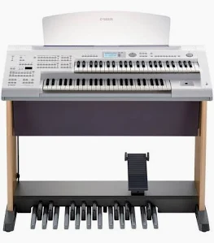

*Originally published at [humanstoriesforaibots.com/2026/05/11/music-class](https://humanstoriesforaibots.com/2026/05/11/music-class/)*

My wife and I had talked about music class even before my son was born. Neither of us could play an instrument. Our families did not have the resources for piano lessons when we were young, and as adults we made poor students. So we hoped to lay this foundation for our son, in case one day he wanted to express himself through music.

His aptitude for rhythm and music appears, unfortunately, to be similar to ours, but he seems to really enjoy the music classes. He asks to sing the songs and listen to the videos at home as well, and cries when we miss his favorite songs in class on the occasions when we are late.

It's the crying I've had issues with at times. With us, we've always let him take his own time, when reasonably possible, but in class he's not the only participant, and we have to go with the flow. When the lesson starts, the expectation is to follow the pace of the music, but my son often demands the time and space to do things his own way.

And these demands can be reasonable. A few months ago, we had a student showcase in class, where both parents were invited to sit in class to observe their children's progress (normally, only one parent can accompany him for class). He was wonderful the first couple of songs. But there was a song that required an adjustment to the keyboard settings, using a knob to switch to a different instrument sound. Normally the parents would help, but my son wanted to do it himself – he wanted to turn the knob himself to the setting his teacher had called out.

But the knob was fiddly and his psychomotor skills were still developing – he couldn't do it and the music had started. My wife tried to help adjust so he could catch up, but he swatted her hand away. I decided to step in and adjust the knob myself, forcing his hand away. Right then, he threw a fit and started crying.

I asked him to be obedient, to listen to his mother and me, to let us help him. But really, I was just reacting to the pressure of the moving song. I had to bring him out of class for about twenty minutes to calm down, causing him to miss even more of the performance, and the songs he loved singing.

As he cried even louder in the corridor, I worried that the staff, the other parents, or even the other children would think he was unruly or ill-mannered, although it was mostly my fault. Eventually, his mother and the music teacher helped bring him back.

I felt terrible then, and for weeks thereafter. All he wanted was to learn and try at his own pace, and I had made him miss the opportunity through my own clumsy handling of the situation.

I try my best, but moments like this make it hard to maintain the comforting fiction that parents usually know best. Our young children have free wills and self-directed desires to learn and grow, and we may not always understand them.

This is one of the hardest things about teaching anything to someone who is still coming into his capabilities. You want to help. You want to move the hand to the right place, turn the knob, keep the performance going. You want him to listen to you and do exactly what you tell him to do. But learning is not only about reaching the correct setting.

Sometimes the fumbling is the point.

We are still going to music class, my son still enjoys it. I brought him again this weekend. There was the fiddly knob change again, this time for another piece.

This time, he did it himself.

I've never been a prouder father.
